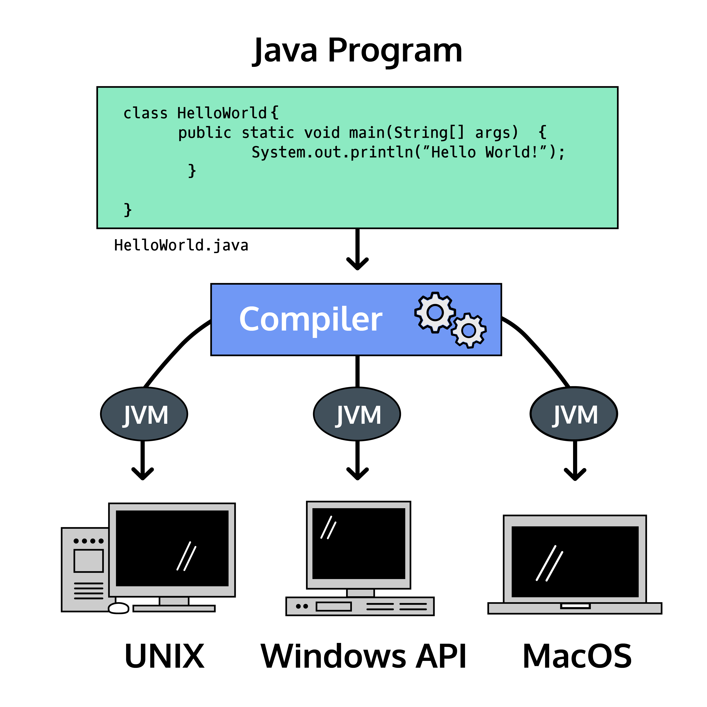
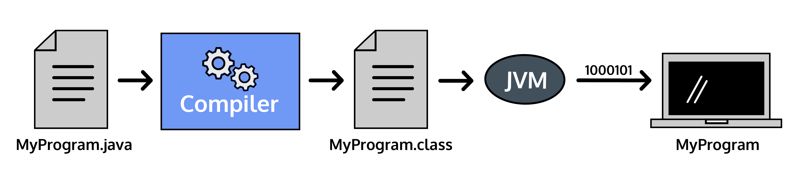

<h1 style="color: lightgreen">Introduction to Java</h1>
<h2># Part I</h2>
<a href="https://www.codecademy.com/resources/docs/java">codecademy</a>
<p>Programming languages enable humans to write instructions that a computer can perform. With precise instructions, computers coordinate applications and systems that run the modern world.</p>
<p>One reason people love Java is the Java Virtual Machine, which ensures the same Java code can be run on different operating systems and platforms. Sun Microsystems’ slogan for Java was “write once, run everywhere”.</p>


<p>We write syntax in <a href="">files</a> to create programs, which are executed by the computer to perform the desired task.
Java provides a number of different classes and methods for utilizing files and a computer’s file system. They include the File, FileReader, and FileWriter classes (all from the java.io package).</p>

<h3 style="color:greenyellow">! <a style="color:greenyellow" href="https://www.codecademy.com/learn/learn-java/modules/learn-java-hello-world/cheatsheet">cheatsheet</a></h3>

<h2 style="color: orange">Java File!</h2>
Java <a href="https://www.codecademy.com/resources/docs/java/files">files</a> have a .java extension.

Each file has one primary class named after the file. Every word is capitalized.
<p>Inside the class we had a main() method which lists our program tasks:</p>

```
public static void main(String[] args) {

}
```
static; public; void; 

String[] args is a placeholder for information we want to pass into our program.

<h2 style="color: orange">Print Statements</h2>
Print statements output information to the screen (also referred to as the output terminal).

```
System.out.println("Hello World");
```

* System is a built-in Java class that contains useful tools for our programs.
* out is short for “output”.
* println is short for “print line”

print - cursor stays on the same line.

println - the cursor is moved to the next line.

<h2 style="color: orange">Commenting Code</h2>
<p>We can also write comments, notes to human readers of our code. These comments are not executed, so there’s no need for valid syntax within a comment.</p>

* When comments are short we use the single-line syntax: <b style="color: yellow"> // </b>
* When comments are long we use the multi-line syntax: <b style="color: yellow"> /* and */. </b>
* Javadoc comment which is represented by <b style="color: yellow"> /** and */ </b> Javadoc comments are used to create documentation for APIs (Application Programming Interfaces). When writing Javadoc comments, remember that they will eventually be used in the documentation that your users might read, so make sure to be especially thoughtful when writing these comments

<h2 style="color: orange">Compilation: Catching Errors</h2>
<p>Java is a compiled programming language, meaning the code we write in a .java file is transformed into byte code by a compiler before it is executed by the Java Virtual Machine on your computer</p>


The compiling process catches <b>mistakes</b> before the computer runs our code.

For example, with a file called Plankton.java, we could compile it with the terminal command:
```
javac Plankton.java
```

ls - this command lists all the available files.

A successful compilation produces a .class file: Plankton.class, that we execute with the terminal command: 

```
java Plankton
```

An unsuccessful compilation produces a list of <a href="https://www.codecademy.com/resources/docs/java/errors?page_ref=catalog">errors</a>. No .class file is made until the errors are corrected and the compile command is run again.
<h2 style="color: orange">Compilation: Creating Executables</h2>

```java

//within the file: Welcome.java
public class Welcome {
  public static void main(String[] args) {
    System.out.println("Welcome to Codecademy's Java course!");
  }
}
```


We have one file: Welcome.java. We compile with the command: 
```
javac Welcome.java
```
The terminal shows no errors, which indicates a successful compilation.

We now have two files:

   1. Welcome.java, our original file with Java syntax.
   2. Welcome.class, our compiled file with Java bytecode, ready to be executed by the Java Virtual Machine.

We can execute the compiled class with the command: 
```
java Welcome
```
Java Review: Putting It All Together

In this lesson, we’ve started writing our first programs in Java.

We’ve also learned rules and guidelines for how to write Java programs:

-----------------------------------------------    review     ----------------------------------------------------------

    Java programs have at least one class and one main() method.
       - Each class represents one real-world idea.
       - The main() method runs the tasks of the program.
    Java comments add helpful context to human readers.
    Java has whitespace, curly braces, and semicolons.
       - Whitespace is for humans to read code easily.
       - Curly braces mark the scope of a class and method.
       - Semicolons mark the end of a statement.
    Java is a compiled language.
       - Compiling catches mistakes in our code.
       - Compilers transform code into an executable class.

<h2># Part II</h2>
<h2 style="color: orange">Variables</h2>
We store information in variables, named locations in memory. Naming a piece of information allows us to use that name later, accessing the information we stored.
Variables also give context and meaning to the data we’re storing.

<p style="color: limegreen">In Java, we specify the type of information we’re storing:</p>

* int
    
    (-2,147,483,648 and 2,147,483,647)
* char
   
    The char data type can hold any character, like a letter, space, or punctuation mark.
    It must be surrounded by single quotes, '.
    ```java
    char grade = 'A';
    char firstLetter = 'p';
    char punctuation = '!'; 
    ```

* boolean
  
    (true / false)
* byte
* long
* short
* double   (12.45)
* float


We must declare a variable to reference it within our program. Declaring a variable requires that we specify the type and name:

```java
// datatype variableName
int age;
double salaryRequirement;
boolean isEmployed;
```
These variables don’t have any associated value. To assign a value to a variable, we use the assignment operator =:

```java
age = 85;
```

* String 

Strings hold sequences of characters. Are two ways to create a String object: using a String literal or calling the String class to create a new String object.

-- String literal is any sequence of characters enclosed in double-quotes ("").
```java
String greeting = "Hello World";
```

-- String object by calling the String class when declaring a String like so:
```java
String salutations = new String("Hello World");
```


    \n - new line

        \t - tab 

<h3> - Static Checking</h3>
<p>The Java programming language has static typing. Java programs will not compile if a variable is assigned a value of an incorrect type. Static typing helps because bugs are caught during programming rather than during execution of the code.</p>
<h3> - Naming</h3>

Naming variables according to convention leads to clear, readable, and maintainable code. In Java, variable names are case-sensitive. myHeight is a different variable from myheight.
A variable starts with a valid letter, or a $, or a _. No other symbols or numbers can begin a variable name. 1stPlace and *Gazer are not valid variable names.

* camelCase.

<h2 style="color: orange">Introduction to Classes</h2>
All programs require one or more classes that act as a model for the world.

For example, a program to track student test scores might have Student, Course, and Grade classes. Our real-world concerns, students and their grades, are inside the program as classes.

<p style="color: violet">We represent each student as an instance, or object, of the Student class.</p>

This is object-oriented programming because programs are built around objects and their interactions. An object contains state and behavior.

Example:
Savings account at a bank.

What should a savings account know?

  - The balance of money available.

What should a savings account do?

  - Deposit money.
  - Withdraw money.

  
  Imagine two people have accounts that are instances of the SavingsAccount class. They share behavior (how they deposit and withdraw) but have individual state (their balances), and even with the same balance amount these accounts are separate entities.

```java
public class Store {
  // instance fields
  String productType;
  int inventoryCount;
  double inventoryPrice;
  
  // constructor method
  public Store(String product, int count, double price) {
    productType = product;
    inventoryCount = count;
    inventoryPrice = price;
  }
  
  // main method
  public static void main(String[] args) {
    Store lemonadeStand = new Store("lemonade", 42, .99);  
    Store cookieShop = new Store("cookies", 12, 3.75);
    
    System.out.println("Our first shop sells " + lemonadeStand.productType + " at " + lemonadeStand.inventoryPrice + " per unit.");
    
    System.out.println("Our second shop has " + cookieShop.inventoryCount + " units remaining.");
  }
}
```

<h3> - Syntax</h3>
The fundamental concept of object-oriented programming is the class.

Here’s a definition of a Java class:
```java
public class Car {
// scope of Car class starts after curly brace
 
  public static void main(String[] args) {
    // scope of main() starts after curly brace
 
    // program tasks
 
  }
  // scope of main() ends after curly brace
 
}
// scope of Car class ends after curly brace

```
This example defines a class named Car. public is an access level modifier that allows other classes to interact with this class.
This class has a main() method, which lists the tasks performed by the program. main() runs when we execute the compiled Car.class file.

<h3> - Constructors</h3>

In order to create an object (an instance of a class), we need a constructor method. The constructor is defined within the class.

```java
public class Car {
  // Constructor method
  public Car() {
    // instructions for creating a Car instance
  }
}
```
To create an instance, we need to call or invoke the constructor within main(). The following example assigns a Car instance to the variable ferrari:

```java
public class Main {
    
  public static void main(String[] args) {
    // Invoke the constructor
    Car ferrari = new Car(); 
  }
}
```

Variable ferrari is declared as a reference data type. This means that the value of our variable is a reference to an instance’s memory address. During its declaration, the class name is used as the variable’s type. In this case, the type is Car.

After the assignment operator, (=), we invoke the constructor method: Car(), and use the keyword new to indicate that we’re creating an instance. 

If we were to output the value of ferrari we would see its memory address:
```java
Car@76ed5528
```

An example 
```java
public class Store {
  
  // new method: constructor!
  public Store() {
    System.out.println("I am inside the constructor method.");
  }
  
  
  
  // main method is where we create instances!
  public static void main(String[] args) {
    System.out.println("Start of the main method.");
    
    // create the instance below
    Store lemonadeStand = new Store();
    
    // print the instance below
    System.out.println(lemonadeStand);
  }
}
```
<h3> - Constructor Parameters</h3>
<p>To create objects with dynamic, individual states, we’ll use a combination of the constructor method and instance fields.

In order to assign a value to an instance variable, we need to alter our constructor method to include parameters so that it can access the data we want to assign to an instance. </p>
<p>In Java, because of constructor overloading, a class can have multiple constructors as long as they have different parameter values. The signature is useful in that it helps the compiler differentiate between the different methods. For example:</p>

```java
public class Car {
  String color;
  int mpg;
  boolean isElectric;
 
  // constructor 1
  public Car(String carColor, int milesPerGallon) {
    color = carColor;
    mpg = milesPerGallon;
  }
  // constructor 2
  public Car(boolean electricCar, int milesPerGallon) {
    isElectric = electricCar;
    mpg = milesPerGallon;
  }
}

```

<h3> - Assigning Values to Instance Fields</h3>
<p>Now that our constructor has a parameter, we must pass values into the method call. These values are referred to as arguments; once they are passed in, they will be used to give the instance fields initial value.</p>

```java
public class Store {
  // instance fields
  String productType;
  
  // constructor method
  public Store(String product) {
    productType = product;
  }
  
  // main method
  public static void main(String[] args) {
    Store lemonadeStand = new Store("lemonade");
    System.out.println(lemonadeStand.productType);
  }
}

```


We can declare as many fields as are necessary for the requirements of our program.
<p>The constructor now has multiple parameters to receive values for the new fields. We still specify the type as well as the name for each parameter.

Ordering matters! We must pass values into the constructor invocation in the same order that they’re listed in the parameters.</p>

```java
public class Store {
  // instance fields
  String productType;
  int inventoryCount;
  double inventoryPrice;
  
  // constructor method
  public Store(String product, int count, double price) {
    productType = product;
    inventoryCount = count;
    inventoryPrice = price;

  }
  
  // main method
  public static void main(String[] args) {

    Store cookieShop = new Store("cookies", 12, 3.75);
    System.out.println(cookieShop.inventoryPrice);
    
  }
}
```

<h3> - Review</h3>
Java is an object-oriented programming language where every program has at least one class.
Classes define the state and behavior of their instances. Behavior comes from methods defined in the class. State comes from instance fields declared inside the class.

```java
public class Dog {
  String breed;
  boolean hasOwner;
  int age;
  
  public Dog(String dogBreed, boolean dogOwned, int dogYears) {
    System.out.println("Constructor invoked!");
    breed = dogBreed;
    hasOwner = dogOwned;
    age = dogYears;
  }
  
  public static void main(String[] args) {
    System.out.println("Main method started");
    Dog fido = new Dog("poodle", false, 4);
    Dog nunzio = new Dog("shiba inu", true, 12);
    boolean isFidoOlder = fido.age > nunzio.age;
    int totalDogYears = nunzio.age + fido.age;
    System.out.println("Two dogs created: a " + fido.breed + " and a " + nunzio.breed);
    System.out.println("The statement that fido is an older dog is: " + isFidoOlder);
    System.out.println("The total age of the dogs is: " + totalDogYears);
    System.out.println("Main method finished");
  }
}
```

<h2># Part III</h2>
<h2 style="color: orange">Class Scanner</h2>

```java
import java.util.Scanner;
```

```java
Scanner input = new Scanner(System.in);
            System.out.print("Insert your name");
            String name = input.nextLine();
            System.out.println("Hello, "+name);

            int num = input.nextInt();
            byte num2 = input.nextByte();

```


